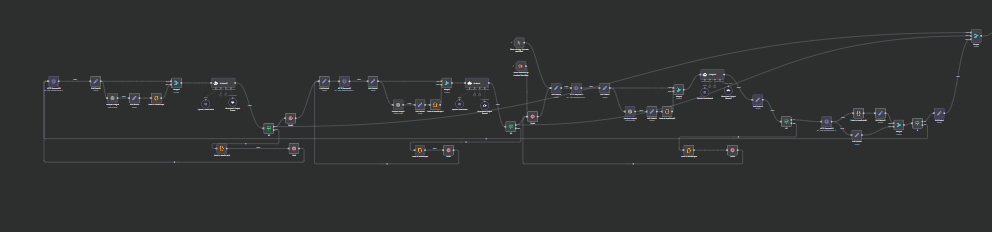
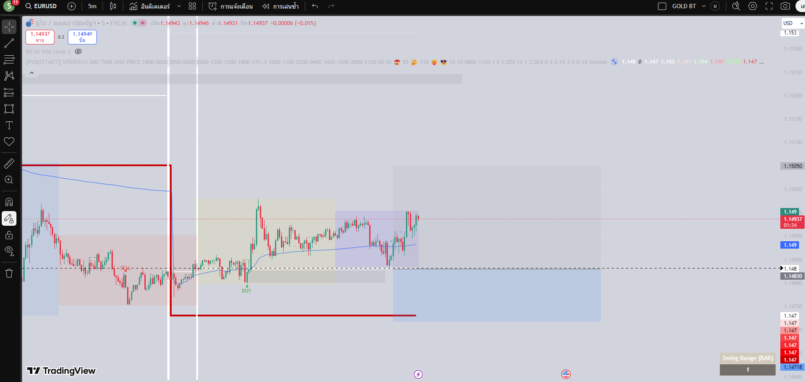

# n8n Workflow Analysis - Multi-Timeframe SMC Trading System

**เอกสารวิเคราะห์ระบบเทรด Smart Money Concepts แบบ Multi-Timeframe**

วันที่สร้าง: 2025-11-05

---

## 📋 ภาพรวมระบบ (System Overview)

ระบบนี้เป็น **AI-Powered Multi-Timeframe Trading System** ที่ใช้แนวคิด Smart Money Concepts (SMC) ในการวิเคราะห์ตลาดและตัดสินใจเทรด โดยแบ่งเป็น 2 workflows หลัก:

1. **mainfull.json** - Main Wrapper Workflow (Entry Point)
2. **subsmc.json** - Core Trading Logic Workflow (Sub-Workflow)

---

## 🎯 Workflow 1: mainfull.json (Main Wrapper)

### โครงสร้าง
```
[Trigger] → [Call subsmc] → [Wait 30s] → [HTTP Request]
```

### รายละเอียด Nodes

| Node | Type | Function |
|------|------|----------|
| **n8n Trigger** | n8n-nodes-base.n8nTrigger | เริ่มต้น workflow เมื่อ activate |
| **Webhook** | n8n-nodes-base.webhook | รับ trigger จาก external webhook (path: `/test`) |
| **Call 'subsmc'** | n8n-nodes-base.executeWorkflow | เรียก workflow ID: YdlCFxWpqKQf9vlW |
| **Wait** | n8n-nodes-base.wait | รอ 30 วินาที |
| **HTTP Request1** | n8n-nodes-base.httpRequest | ส่ง request ไปที่ webhook test endpoint |

### Trading Logic (Level 1)

1. **Activation**: ระบบ activate ผ่าน 2 ทางทาง
   - Manual trigger (n8n Trigger)
   - External webhook call

2. **Delegation**: ส่งงานทั้งหมดไปที่ `subsmc` workflow

3. **Completion**: รอ 30 วินาทีแล้วส่งผลลัพธ์กลับ

---

## 🔥 Workflow 2: subsmc.json (Core Trading Engine)

### Architecture Overview

ระบบ **Multi-Agent Hierarchical Architecture** แบ่งเป็น 4 layers:

```
┌─────────────────────────────────────────────────────────┐
│                    ENTRY POINT                          │
│  - When Executed by Another Workflow                    │
│  - When clicking 'Execute workflow'                     │
└────────────────────┬────────────────────────────────────┘
                     │
     ┌───────────────┴───────────────┐
     │                               │
     ▼                               ▼
┌─────────────────┐         ┌─────────────────┐
│  Layer 1: HTF   │         │  Timeframe      │
│  (1H Analysis)  │◄────────┤  Sync Loop      │
│  AI Agent7      │         │  (Wait Logic)   │
└────────┬────────┘         └─────────────────┘
         │
         ├─── [If3: Check market_bias]
         │     ├─ BULLISH/BEARISH → Continue
         │     └─ NEUTRAL/WEAK → Wait & Re-analyze
         │
         ▼
┌─────────────────┐
│  Layer 2: MTF   │
│  (15M Setup)    │
│  AI Agent       │
└────────┬────────┘
         │
         ├─── [If6: Check setup_quality]
         │     ├─ EXCELLENT/GOOD → Continue
         │     └─ LOW/WEAK → Wait & Re-analyze
         │
         ▼
┌─────────────────┐
│  Layer 3: LTF   │
│  (5M Execute)   │
│  AI Agent1      │
└────────┬────────┘
         │
         ├─── [If7: Check execution_ready]
         │     ├─ TRUE → Get ATR & Price Data
         │     └─ FALSE → Wait & Re-analyze
         │
         ▼
┌─────────────────┐
│ [Merge1]: Combine 1H + 15M + 5M Data
└────────┬────────┘
         │
         ▼
┌─────────────────┐
│  Layer 4: Final │
│  (Coordinator)  │
│  AI Agent2      │
└────────┬────────┘
         │
         ▼
┌─────────────────┐
│  Output:        │
│  - Telegram x5  │
│  - Final Signal │
└─────────────────┘
```

---

## 🧠 AI Agents และหน้าที่

### 🔵 AI Agent7 - HTF Agent (1H Timeframe)

**หน้าที่:** Strategic Market Analysis (Higher Timeframe)

**Input:**
- HTTP Request20: ดึงข้อมูล 1H candles จาก ngrok endpoint
- `frame=1h&index=100&include_image=true&chart_candles=100`

**Process:**
1. **HTTP Request20** → ดึงข้อมูล 1H
2. **Edit Fields3** → จัดรูปแบบข้อมูล (candles, timeframe, image_url)
3. **Analyze image8** → วิเคราะห์ chart image ด้วย GPT-4o
4. **Code in JavaScript1** → สร้าง content field สำหรับ AI Agent
5. **Merge4** → รวมข้อมูล candles + image analysis
6. **AI Agent7** → วิเคราะห์ด้วย GPT-5 Chat Latest
   - Model: `gpt-5-chat-latest`
   - Output Parser: Structured JSON

**Output Structure:**
```json
{
  "analysis": {
    "market_bias": {
      "direction": "BULLISH|BEARISH|NEUTRAL",
      "strength": "STRONG|MODERATE|WEAK",
      "confidence": 0.0-1.0
    },
    "market_structure": {
      "bos": [...],
      "choch": [...],
      "trend": "..."
    },
    "key_levels": {
      "ob": [...],
      "fvg": [...],
      "liquidity": [...]
    },
    "guidance_for_15m": "..."
  }
}
```

**Decision Gate: If3**
- **Condition:** `market_bias.direction == "BULLISH" OR "BEARISH"`
- **TRUE Path:** → Wait5 → Continue to 15M Agent + Send to Merge1
- **FALSE Path:** → Code in JavaScript4 → Wait (sync timeframe) → Loop back to HTTP Request20

**Trading Logic:**
- ถ้า market bias ไม่ชัดเจน (NEUTRAL) → รอจนกว่า candle ถัดไปจะปิด แล้ววิเคราะห์ใหม่
- ใช้ **Timeframe Sync Logic** เพื่อรอให้ candle 1H ปิดก่อนวิเคราะห์รอบใหม่

---

### 🟢 AI Agent - MTF Agent (15M Timeframe)

**หน้าที่:** Entry Setup Identification (Medium Timeframe)

**Input:**
- **HTF Guidance** จาก AI Agent7 (ผ่าน Wait5 → Edit Fields6)
- HTTP Request17: ดึงข้อมูล 15M candles
- `frame=15m&index=100&include_image=true&chart_candles=100`

**Process:**
1. **Wait5** → รอจนกว่า 1H agent เสร็จ (If3 = TRUE)
2. **Edit Fields6** → เตรียมข้อมูลสำหรับ HTTP Request
3. **HTTP Request17** → ดึงข้อมูล 15M
4. **Edit Fields2** → จัดรูปแบบข้อมูล
5. **Analyze image7** → วิเคราะห์ chart image ด้วย GPT-4o
6. **Code in JavaScript2** → สร้าง guidance_for_15m field
7. **Merge3** → รวม candles + image + guidance จาก 1H
8. **AI Agent** → วิเคราะห์ด้วย GPT-5
   - รับ context จาก 1H (market_bias, key_levels)
   - หา entry setups ที่ align กับ HTF bias

**Output Structure:**
```json
{
  "analysis": {
    "setup_quality": {
      "rating": "EXCELLENT|GOOD|MODERATE|LOW",
      "confidence": 0.0-1.0
    },
    "entry_setups": [
      {
        "type": "OB|FVG|Liquidity_Sweep",
        "zone": {
          "high": 0.0,
          "low": 0.0
        },
        "direction": "LONG|SHORT",
        "quality": "HIGH|MEDIUM|LOW",
        "rr_ratio": 0.0
      }
    ],
    "guidance_for_5m": "..."
  }
}
```

**Decision Gate: If6**
- **Condition:** `setup_quality.rating == "EXCELLENT" OR "GOOD"`
- **TRUE Path:** → Wait4 → Continue to 5M Agent + Send to Merge1
- **FALSE Path:** → Code in JavaScript5 → Wait2 (sync 15M) → Loop back to Edit Fields6

**Trading Logic:**
- ต้อง align กับ 1H bias (BULLISH → หา LONG setups, BEARISH → หา SHORT setups)
- ถ้า setup quality ต่ำกว่า GOOD → รอ candle 15M ถัดไปแล้ววิเคราะห์ใหม่
- ส่ง entry zones ให้ 5M agent เพื่อหาจุดเข้าที่แม่นยำ

---

### 🟡 AI Agent1 - LTF Agent (5M Timeframe)

**หน้าที่:** Precise Execution & Trade Management (Lower Timeframe)

**Input:**
- **HTF Bias** จาก AI Agent7
- **MTF Setup** จาก AI Agent
- HTTP Request21: ดึงข้อมูล 5M candles
- `frame=5m&index=100&include_image=true&chart_candles=100`

**Process:**
1. **Wait4** → รอจนกว่า 15M agent เสร็จ (If6 = TRUE)
2. **Edit Fields9** → เตรียมข้อมูล
3. **HTTP Request21** → ดึงข้อมูล 5M
4. **Edit Fields7** → จัดรูปแบบข้อมูล
5. **Analyze image9** → วิเคราะห์ chart image ด้วย GPT-4o
6. **Code in JavaScript3** → สร้าง guidance_for_5m field
7. **Merge5** → รวม candles + image + guidance จาก 15M
8. **AI Agent1** → วิเคราะห์ด้วย GPT-5
   - Refine entry points ตาม 5M structure
   - กำหนด Stop Loss ที่แม่นยำ
   - ระบุ Take Profit zones

**Output Structure:**
```json
{
  "analysis": {
    "execution_ready": true|false,
    "entry_signal": {
      "type": "MARKET|LIMIT",
      "price": 0.0,
      "direction": "LONG|SHORT"
    },
    "stop_loss": 0.0,
    "take_profit": [0.0, 0.0],
    "trade_management": {
      "breakeven_at": 0.0,
      "partial_tp": [...],
      "trailing_stop": true|false
    }
  }
}
```

**Decision Gate: If7**
- **Condition:** `data == "true"` (execution_ready)
- **TRUE Path:** → HTTP Request22 (get ATR + price data) → Continue
- **FALSE Path:** → Code in JavaScript6 → Wait3 (sync 5M) → Loop back to Wait4

**Trading Logic:**
- ยืนยัน entry signals จาก 15M
- ถ้ายังไม่พร้อม execute → รอ candle 5M ถัดไป
- เมื่อพร้อม → ดึงข้อมูล ATR และราคาปัจจุบันเพื่อคำนวณ position size

---

### 🔷 AI Agent2 - Coordinator Agent (Final Decision)

**หน้าที่:** Final Decision Maker & Risk Management

**Input:**
- **Merge1** → รวมข้อมูลจาก 3 agents (1H + 15M + 5M)
- Additional data:
  - ATR ข้อมูล (จาก HTTP Request22)
  - Current price (close_last_candle)

**Process:**
1. **Merge1** → รวมผลวิเคราะห์ 3 timeframes
2. **Aggregate** → รวมข้อมูลทั้งหมดเป็น array
3. **Edit Fields** → สร้าง final input structure:
   ```json
   {
     "dataTF1H": {...},
     "dataTF15M": {...},
     "dataTF5M": {...}
   }
   ```
4. **AI Agent2** → ตัดสินใจขั้นสุดท้ายด้วย GPT-5
   - ประเมิน alignment score (3 timeframes)
   - คำนวณ risk-reward
   - กำหนด position size
   - ตัดสินใจ TRADE/WAIT/NO_TRADE

**Output Structure:**
```json
{
  "final_decision": {
    "action": "TRADE|WAIT|NO_TRADE",
    "alignment_score": "3/3|2/3|1/3|0/3",
    "confidence": 0.0-1.0
  },
  "trade_plan": {
    "direction": "LONG|SHORT",
    "entry": 0.0,
    "stop_loss": 0.0,
    "take_profit": [0.0, 0.0],
    "position_size": "100%|50%|25%",
    "risk_percentage": 0.0
  },
  "reasoning": {
    "strengths": [...],
    "concerns": [...],
    "conflicts": [...]
  }
}
```

**Decision Logic:**

| 1H | 15M | 5M | Score | Action | Position Size |
|----|-----|----|-------|--------|---------------|
| 🟢 | 🟢 | 🟢 | 3/3 | ✅ TRADE | 100% |
| 🟢 | 🟢 | 🟡 | 2/3 | ⏳ WAIT | - |
| 🟢 | 🟡 | 🟢 | 2/3 | ⚠️ TRADE | 50% |
| 🟢 | 🔴 | Any | 1/3 | 🚫 NO TRADE | 0% |

**Final Output:**
1. **Aggregate1** → รวมผลลัพธ์
2. **Code in JavaScript** → format ข้อความสำหรับแจ้งเตือน
3. **Aggregate2** → เตรียมข้อมูลสำหรับ Telegram
4. **Wait1** → delay ก่อนส่ง
5. **Send a text message (x5)** → ส่ง Telegram notifications:
   - Message 1: 1H Analysis Summary
   - Message 2: 15M Setup Details
   - Message 3: 5M Execution Plan
   - Message 4: Coordinator Decision
   - Message 5: Complete Trading Plan

---

## 🔄 Timeframe Synchronization Logic

ระบบใช้ **Intelligent Wait Logic** เพื่อให้แน่ใจว่า agents จะวิเคราะห์เมื่อ candle ปิดเท่านั้น

### Code Pattern (ใช้ในทุก timeframe)

```javascript
// --- ตัวแปร timeframe ---
const agentType = $json.agentType || "1H"; // 1H, 15M, 5M
let intervalMinutes = 0;

switch (agentType) {
  case "1H": intervalMinutes = 60; break;
  case "15M": intervalMinutes = 15; break;
  case "5M": intervalMinutes = 5; break;
}

// --- เวลาปัจจุบัน ---
const now = new Date();

// --- ปัดขึ้นให้ตรงรอบ timeframe ---
const next = new Date(now);
next.setMinutes(Math.ceil(now.getMinutes() / intervalMinutes) * intervalMinutes);
next.setSeconds(0, 0);

// ถ้ารอบถัดไป <= ตอนนี้ → บวกเพิ่มอีกหนึ่งรอบ
if (next <= now) {
  next.setMinutes(next.getMinutes() + intervalMinutes);
}

// --- เวลาที่ต้องรอ (ms) ---
const waitMs = next - now;

// --- Log เวลา ---
console.log(`🔄 [${agentType}] Next round at ${next.toLocaleTimeString()}`);
console.log(`⏱️ Wait ${(waitMs / 1000 / 60).toFixed(2)} minutes`);

// --- Output สำหรับใช้ต่อใน node Wait ---
return [
  {
    json: {
      agentType,
      nextRunTime: next.toISOString(),
      waitMs,
    },
  },
];
```

### Nodes ที่ใช้ Timeframe Sync:

1. **Code in JavaScript4** + **Wait** → 1H sync loop
2. **Code in JavaScript5** + **Wait2** → 15M sync loop
3. **Code in JavaScript6** + **Wait3** → 5M sync loop

---

## 📊 Data Flow Diagram

```
┌──────────────────┐
│  External API    │
│  (ngrok endpoint)│
└────────┬─────────┘
         │
         ├─── HTTP Request20 (1H data)
         ├─── HTTP Request17 (15M data)
         └─── HTTP Request21 (5M data)

┌──────────────────┐
│  Image Analysis  │
│  (GPT-4o)        │
└────────┬─────────┘
         │
         ├─── Analyze image8 (1H chart)
         ├─── Analyze image7 (15M chart)
         └─── Analyze image9 (5M chart)

┌──────────────────┐
│  AI Agents       │
│  (GPT-5 Chat)    │
└────────┬─────────┘
         │
         ├─── AI Agent7 (1H) → market_bias
         ├─── AI Agent (15M) → entry_setups
         ├─── AI Agent1 (5M) → execution_signals
         └─── AI Agent2 (Coordinator) → final_decision

┌──────────────────┐
│  Output          │
└────────┬─────────┘
         │
         └─── Telegram (5 messages)
```

---

## 🎯 Trading Logic Breakdown

### Phase 1: Market Direction (1H - HTF)

**Objective:** กำหนด Market Bias

**Analysis Focus:**
- **BOS (Break of Structure):** ยืนยัน trend continuation
- **CHoCH (Change of Character):** สัญญาณ potential reversal
- **Order Blocks:** institutional entry zones
- **Liquidity Zones:** target areas for smart money

**Decision Criteria:**
```
IF market_bias == BULLISH:
    → Look for LONG opportunities
    → Key levels: Bullish OB, Demand zones
    → Wait for pullbacks to premium zones

ELSE IF market_bias == BEARISH:
    → Look for SHORT opportunities
    → Key levels: Bearish OB, Supply zones
    → Wait for pullbacks to discount zones

ELSE (NEUTRAL):
    → Wait for next candle
    → Re-analyze market structure
```

---

### Phase 2: Entry Setup (15M - MTF)

**Objective:** หา High-Quality Entry Zones

**Requirements:**
1. **Must align with 1H bias**
2. **Setup quality >= GOOD**
3. **Risk-Reward >= 1:2**

**Analysis Focus:**
- **FVG (Fair Value Gaps):** price inefficiencies
- **Order Block Mitigation:** respect/violation ของ OB
- **Liquidity Sweeps:** stop hunt patterns
- **Premium/Discount Zones:** 50% Fibonacci levels

**Setup Quality Scoring:**
```
EXCELLENT:
- Perfect alignment with 1H
- Multiple confluence factors (OB + FVG + Liquidity)
- Clean structure
- High RR ratio (>3:1)

GOOD:
- Good alignment with 1H
- 2 confluence factors
- Decent structure
- RR ratio (>2:1)

MODERATE:
- Partial alignment
- 1 confluence factor
- Average structure
- RR ratio (~1.5:1)

LOW:
- Weak alignment
- No clear confluence
- Choppy structure
- RR ratio (<1.5:1)
```

---

### Phase 3: Execution (5M - LTF)

**Objective:** จุดเข้าที่แม่นยำ + Trade Management

**Validation Checklist:**
- [ ] 1H bias confirmed
- [ ] 15M setup identified
- [ ] 5M structure aligned
- [ ] Entry trigger formed
- [ ] Risk parameters defined

**Entry Triggers:**
1. **Break and Retest:** structure break + pullback ใน 5M
2. **Order Block Tap:** price พิง OB zone
3. **FVG Fill:** price เข้า fill FVG แล้ว reject
4. **Liquidity Sweep:** sweep liquidity แล้ว reversal

**Stop Loss Placement:**
- **Conservative:** ใต้/เหนือ 5M swing low/high
- **Aggressive:** ใต้/เหนือ immediate structure
- **Based on ATR:** dynamic SL ตาม volatility

**Take Profit Strategy:**
1. **TP1 (30-50%):** First key level / 1:1.5 RR
2. **TP2 (30-40%):** Major HTF level / 1:3 RR
3. **TP3 (20-30%):** Extended target / 1:5+ RR

**Trade Management Rules:**
```
IF price hits TP1:
    → Move SL to breakeven
    → Close 30-50% position

IF price hits TP2:
    → Trail SL below recent swing
    → Close additional 30-40%

IF price reverses before TP1:
    → Check 5M structure
    → Consider early exit if structure breaks
```

---

### Phase 4: Coordinator Decision

**Objective:** Final Risk Assessment & Position Sizing

**Alignment Score Calculation:**
```javascript
let score = 0;

// 1H Contribution (40%)
if (htf_bias == "BULLISH" || htf_bias == "BEARISH") {
    if (htf_confidence > 0.7) score += 1.0;
    else if (htf_confidence > 0.5) score += 0.7;
    else score += 0.3;
}

// 15M Contribution (35%)
if (mtf_quality == "EXCELLENT") score += 1.0;
else if (mtf_quality == "GOOD") score += 0.7;
else if (mtf_quality == "MODERATE") score += 0.4;

// 5M Contribution (25%)
if (ltf_execution_ready == true) {
    if (ltf_confidence > 0.7) score += 1.0;
    else if (ltf_confidence > 0.5) score += 0.7;
}

// Normalize to 0-3 scale
alignment_score = Math.round(score);
```

**Position Sizing Logic:**
```javascript
let position_size = 0;

switch (alignment_score) {
    case 3: // Perfect alignment
        position_size = 100;
        break;
    case 2: // Good alignment
        if (htf_bias_strong && mtf_quality_excellent) {
            position_size = 75;
        } else {
            position_size = 50;
        }
        break;
    case 1: // Weak alignment
        position_size = 25; // Small position or skip
        break;
    case 0: // No alignment
        position_size = 0; // NO TRADE
        break;
}

// Apply confidence multiplier
position_size *= coordinator_confidence;

// Risk management cap
if (position_size > 100) position_size = 100;
if (position_size < 25 && alignment_score >= 2) position_size = 25;
```

**Final Decision Matrix:**

```
Score 3/3 (Perfect):
✅ TRADE
- Position: 100%
- Risk: 1-2% of account
- Confidence: High
- Management: Full plan active

Score 2/3 (Good):
⚠️ TRADE (Reduced)
- Position: 50-75%
- Risk: 0.5-1% of account
- Confidence: Moderate
- Management: Conservative targets

Score 1/3 (Weak):
⏳ WAIT or MICRO
- Position: 0-25%
- Risk: <0.5% of account
- Action: Wait for better setup

Score 0/3 (None):
🚫 NO TRADE
- Position: 0%
- Risk: 0%
- Action: Wait for alignment
```

---

## 🔧 Technical Implementation Details

### AI Models Used

| Component | Model | Purpose |
|-----------|-------|---------|
| **Image Analysis** | GPT-4o-latest | วิเคราะห์ chart images |
| **AI Agents** | GPT-5-chat-latest | Strategic analysis & decision making |
| **Output Parsing** | Structured Output Parser | JSON schema validation |

### HTTP Endpoints

**Base URL:** `https://bab4feb26393.ngrok-free.app`

**Endpoint Pattern:**
```
/send-to-n8n?frame={timeframe}&index={num_candles}&include_image=true&chart_candles={chart_candles}
```

**Parameters:**
- `frame`: 1h | 15m | 5m
- `index`: จำนวน candles ที่ต้องการ (50-300)
- `include_image`: true (generate chart image)
- `chart_candles`: จำนวน candles ที่แสดงใน chart (100)

**Example:**
```
1H: /send-to-n8n?frame=1h&index=100&include_image=true&chart_candles=100
15M: /send-to-n8n?frame=15m&index=100&include_image=true&chart_candles=100
5M: /send-to-n8n?frame=5m&index=100&include_image=true&chart_candles=100
```

### Data Processing Nodes

**Edit Fields Pattern:**
```javascript
{
  "candles": "={{ $json.candles }}",
  "timeframe": "={{ $json.timeframe }}",
  "image_url": "={{ $json.image_url }}"
}
```

**Code Processing Pattern:**
```javascript
// Create content field for AI Agent
{
  "content": JSON.stringify({
    candles: $json.candles,
    timeframe: $json.timeframe,
    analysis: $json.analysis // from image
  })
}

// Create guidance field
{
  "guidance_for_15m": $json.output.analysis.guidance_for_15m,
  "guidance_for_5m": $json.output.analysis.guidance_for_5m
}
```

### Merge Strategies

**Merge3, Merge4, Merge5** (Agent Inputs):
```javascript
Mode: "combine"
CombineBy: "combineAll"
// รวม candles + image analysis + guidance
```

**Merge1** (Multi-Timeframe):
```javascript
NumberInputs: 3
// Input 0: 1H data (from If3 TRUE)
// Input 1: 15M data (from If6 TRUE)
// Input 2: 5M data (implicit from Wait4)
```

**Merge6** (ATR Data):
```javascript
// Input 0: ATR calculation (Code in JavaScript8)
// Input 1: Close price (Edit Fields11)
```

---

## 🔁 Loop Mechanisms

ระบบมี **3 levels ของ feedback loops** เพื่อ continuous improvement:

### Level 1: Timeframe Quality Loops

**1H Loop (If3 = FALSE):**
```
AI Agent7 → If3 (market_bias check)
  ├─ FALSE → Code in JavaScript4 → Wait (1H sync)
  └─ Loop back to HTTP Request20 → Re-analyze
```

**15M Loop (If6 = FALSE):**
```
AI Agent → If6 (setup_quality check)
  ├─ FALSE → Code in JavaScript5 → Wait2 (15M sync)
  └─ Loop back to Edit Fields6 → Re-analyze
```

**5M Loop (If7 = FALSE):**
```
AI Agent1 → If7 (execution_ready check)
  ├─ FALSE → Code in JavaScript6 → Wait3 (5M sync)
  └─ Loop back to Wait4 → Re-analyze
```

### Level 2: Data Validation Loop

**If Node (Post-5M):**
```
Merge6 → If (data validation)
  ├─ TRUE → Edit Fields1 → Continue
  └─ FALSE → Loop back to HTTP Request20 (restart from 1H)
```

### Level 3: Main Workflow Loop

**Main wrapper:**
```
mainfull.json → subsmc.json → Wait 30s → HTTP Request
  └─ Loop back (external trigger)
```

---

## 📱 Output & Notifications

### Telegram Integration

ระบบส่ง **5 messages** หลังจาก Coordinator ตัดสินใจ:

| Message | Content | Source |
|---------|---------|--------|
| **Message 1** | 1H HTF Analysis | `$json.data[0].text1` |
| **Message 2** | 15M MTF Setup | `$json.data[1].text2` |
| **Message 3** | 5M LTF Execution | `$json.data[2].text3` |
| **Message 4** | Coordinator Decision | `$json.data[3].text4` |
| **Message 5** | Complete Trade Plan | `$json.data[4].text5` |

**Telegram Credential:** `Telegram account 11`

**Message Flow:**
```
Code in JavaScript → Aggregate2 → Wait1 (delay)
  ├─→ Send a text message1 (1H)
  ├─→ Send a text message (15M)
  ├─→ Send a text message2 (5M)
  ├─→ Send a text message3 (Coordinator)
  └─→ Send a text message4 (Trade Plan)
```

---

## ⚙️ Configuration & Settings

### AI Agent Configuration

```json
{
  "model": "gpt-5-chat-latest",
  "temperature": 0.2,
  "max_tokens": 2000,
  "response_format": {"type": "json_object"},
  "promptType": "define",
  "hasOutputParser": true
}
```

### OpenAI Credentials

**Account:** OpenAi account 10
**API ID:** ujgFVNhTmI1dd0Sl

**Usage:**
- **GPT-4o-latest:** Image analysis (low cost, high vision capability)
- **GPT-5-chat-latest:** Strategic reasoning (high quality, logical consistency)

### Workflow IDs

- **Main Workflow:** `mainfull.json`
- **Sub-Workflow ID:** `YdlCFxWpqKQf9vlW`
- **Webhook Path:** `/test`
- **Webhook ID (Main):** `13e5fe25-808f-49be-8002-ae541e2aceb0`

---

## 🚨 Error Handling & Edge Cases

### Insufficient Data

**Scenario:** API returns insufficient candles

**Handling:**
```
Each Agent → Checks candle count
  IF candles.length < minimum_required:
    → Return error flag
    → Loop back to data fetch
    → Wait for next candle
```

### Conflicting Signals

**Scenario:** Agents disagree (e.g., 1H BULLISH but 15M finds SHORT setups)

**Handling:**
```
Coordinator Agent2 → Detect conflicts
  IF conflict_detected:
    → Lower alignment score
    → Reduce position size or NO TRADE
    → Output conflict reasoning
    → Wait for better alignment
```

### API Failures

**Scenario:** HTTP Request timeout or error

**Handling:**
- Wait nodes have `webhookId` for recovery
- Loops automatically retry after timeout
- System can resume from last successful agent

### Market Closed / Low Liquidity

**Scenario:** Weekend or low-volume periods

**Expected Behavior:**
- Agents will detect low-quality setups
- If6, If7 conditions will fail
- System enters wait loop until better conditions

---

## 📈 Performance Optimization

### Caching Strategy

**1H Analysis:**
- Results valid for 30-60 minutes
- Can cache guidance_for_15m
- Reduces API calls during stable bias

**Image Analysis:**
- Pre-generated charts from API
- Parallel processing with candle data
- GPT-4o optimized for vision tasks

### Parallel Processing

**Opportunities:**
```
Edit Fields2 → Splits into:
  ├─→ Analyze image7 (async)
  └─→ Merge3 (awaits both)
```

### API Call Minimization

**Pattern:**
- Each timeframe fetches data ONCE per analysis
- Loops only occur on quality failures
- Image analysis happens parallel to data processing

---

## 🎓 Best Practices & Tips

### 1. Minimum Candle Requirements

| Timeframe | Minimum | Recommended | For Context |
|-----------|---------|-------------|-------------|
| **1H** | 50 | 100 | Market structure |
| **15M** | 100 | 200 | Entry setups |
| **5M** | 200 | 300 | Precise execution |

### 2. Quality Thresholds

```javascript
// OB.Percentage > 0.6 (strong order block)
// Risk-Reward > 2.0 (minimum for GOOD rating)
// Confidence > 0.7 (high-quality signals)
// Alignment >= 2/3 (required for trading)
```

### 3. Risk Management

```javascript
Max Risk per Trade: 1-2% of account
Max Position Size: 100% of normal size
Min Alignment Score: 2/3 for full position
Stop Loss: Always based on structure, not arbitrary
```

### 4. Monitoring & Logging

```javascript
// Log key decisions
console.log(`[1H] Market Bias: ${bias} (${confidence})`);
console.log(`[15M] Setup Quality: ${quality} (${rr_ratio})`);
console.log(`[5M] Execution Ready: ${ready}`);
console.log(`[Coordinator] Decision: ${action} (${score}/3)`);
```

### 5. Avoiding Over-Trading

**Rules:**
- Wait for 2/3 or 3/3 alignment
- Never force trades in NEUTRAL markets
- Respect loop delays (timeframe sync)
- Quality > Quantity

---

## 🔍 Troubleshooting Guide

### Problem 1: Agents Keep Looping

**Symptoms:** If3, If6, or If7 always FALSE

**Solutions:**
- Check if market is ranging (NEUTRAL bias)
- Verify candle data quality
- Lower quality thresholds (temporary)
- Wait for trending market conditions

### Problem 2: No Telegram Notifications

**Symptoms:** Workflow completes but no messages

**Check:**
1. Telegram credentials active
2. Wait1 delay not too long
3. Code in JavaScript formatting correct
4. Aggregate2 properly structured

### Problem 3: Image Analysis Fails

**Symptoms:** Analyze image nodes return errors

**Solutions:**
- Verify image_url is accessible
- Check OpenAI API quota
- Ensure GPT-4o-latest model available
- Validate image format (PNG/JPG)

### Problem 4: Slow Execution

**Symptoms:** Workflow takes >5 minutes

**Optimizations:**
- Reduce chart_candles parameter
- Cache 1H analysis when possible
- Check API endpoint response time
- Optimize AI Agent prompts

### Problem 5: Inconsistent Decisions

**Symptoms:** Coordinator frequently changes decisions

**Solutions:**
- Increase confidence thresholds
- Require higher alignment scores (3/3 only)
- Add moving average filters to candle data
- Increase minimum candle requirements

---

## 📊 Expected Workflow Performance

### Timing Benchmarks

| Phase | Expected Duration | Notes |
|-------|------------------|-------|
| **1H Agent** | 30-60 seconds | Including image analysis |
| **15M Agent** | 20-40 seconds | Faster due to smaller data |
| **5M Agent** | 15-30 seconds | Quick execution validation |
| **Coordinator** | 10-20 seconds | Final decision |
| **Total** | 2-3 minutes | Full analysis cycle |

### Success Rates (Estimated)

```
If3 Pass Rate: 60-70% (bias clarity)
If6 Pass Rate: 40-50% (setup quality)
If7 Pass Rate: 70-80% (execution ready)

Full Alignment (3/3): ~20-30% of runs
Good Alignment (2/3): ~30-40% of runs
Weak/No Alignment: ~30-50% of runs

Expected Trading Frequency:
- 1-3 high-quality setups per day
- 3-5 moderate setups per day
```

---

## 🎯 Strategic Advantages

### 1. Multi-Timeframe Confluence

**Traditional Trading:**
- Manual chart switching
- Subjective analysis
- Easy to miss alignments

**This System:**
- Automated timeframe analysis
- Objective scoring
- Never misses perfect alignments

### 2. Disciplined Execution

**Human Psychology:**
- FOMO (Fear of Missing Out)
- Revenge trading
- Emotional decisions

**This System:**
- Waits for quality setups
- Follows strict criteria
- Emotion-free decisions

### 3. Consistent Risk Management

**Manual Trading:**
- Variable position sizing
- Inconsistent stop losses
- Emotional exits

**This System:**
- Dynamic position sizing based on alignment
- Structure-based stop losses
- Predefined exit strategies

### 4. Continuous Learning

**Data Collection:**
- Every analysis logged
- Decision reasoning recorded
- Performance trackable

**Future Improvements:**
- Backtest with historical data
- Optimize thresholds
- Refine AI prompts

---

## 🚀 Future Enhancement Possibilities

### 1. Machine Learning Integration

```python
# Potential additions:
- Reinforcement learning for position sizing
- Pattern recognition for setup quality
- Sentiment analysis integration
- Volume profile analysis
```

### 2. Additional Timeframes

```
Current: 1H → 15M → 5M
Potential: Daily → 4H → 1H → 15M → 5M → 1M
```

### 3. Multi-Asset Support

```
Current: Single symbol (likely BTCUSDT)
Potential: Portfolio of 5-10 symbols
- Correlation analysis
- Sector rotation
- Risk diversification
```

### 4. Advanced Trade Management

```
- Dynamic trailing stops
- Partial position pyramiding
- Correlation-based exits
- Volatility-adjusted targets
```

### 5. Backtesting Module

```
- Historical data replay
- Strategy optimization
- Performance metrics
- Risk analytics
```

---

## 📝 Summary

### Key Strengths

✅ **Systematic:** Rule-based, repeatable process
✅ **Multi-Timeframe:** Top-down analysis from HTF to LTF
✅ **Quality-Focused:** Waits for high-probability setups
✅ **Risk-Aware:** Dynamic position sizing and stop placement
✅ **Transparent:** Clear reasoning for every decision
✅ **Automated:** 24/7 operation without manual intervention

### Key Limitations

⚠️ **AI Dependency:** Relies on GPT-5 quality and availability
⚠️ **API Costs:** Frequent AI calls can be expensive
⚠️ **Latency:** 2-3 minutes per full analysis cycle
⚠️ **Ranging Markets:** Struggles in sideways/choppy conditions
⚠️ **Single Asset:** Currently optimized for one symbol

### Ideal Market Conditions

🎯 **Best Performance:**
- Trending markets (strong directional bias)
- High liquidity periods
- Clear market structure (BOS/CHoCH patterns)
- Confluence of multiple SMC concepts

⚠️ **Challenging Conditions:**
- Ranging/sideways markets
- Low liquidity periods (weekends)
- News-driven volatility spikes
- Rapidly changing market structure

---

## 📚 References & Resources

### Smart Money Concepts (SMC)
- Order Blocks (OB)
- Fair Value Gaps (FVG)
- Break of Structure (BOS)
- Change of Character (CHoCH)
- Liquidity Sweeps
- Premium/Discount Zones

### n8n Documentation
- Workflow execution
- AI Agent nodes
- Webhook triggers
- Structured output parsing

### Trading Concepts
- Multi-timeframe analysis
- Risk management
- Position sizing
- Trade management

---

**Document Version:** 1.0
**Last Updated:** 2025-11-05
**Workflow Version:** 2.0 (README reference)
**Optimized For:** n8n + OpenAI GPT-5/GPT-4o + Smart Money Concepts

---

## 📊 Example Results & Live Output

### Workflow Architecture Visualization

รูปที่ 1 แสดงสถาปัตยกรรม n8n workflow แบบเต็ม:



*Complete n8n workflow showing all 4 AI agents (1H, 15M, 5M, Coordinator), decision gates (If3, If6, If7), merge nodes, and complete data flow*

---

### Example 1: 5M Agent Output - EURUSD LONG Entry

**ไฟล์ต้นฉบับ:** [2.1.txt](2.1.txt)

**Output JSON เต็ม:**

```json
[
  {
    "output": {
      "timeframe": "5m",
      "timestamp": "2025-11-05T08:15:00",
      "symbol": "BTCUSDT",
      "analysis": {
        "current_candle_analysis": {
          "type": "Bullish",
          "body_size": "MEDIUM",
          "wicks": {
            "upper": "SHORT",
            "lower": "SHORT"
          },
          "close_position": "Near HIGH",
          "status": "CLOSED",
          "price": 1.1493,
          "signal": "Bullish confirmation candle closed near high showing strong continuation buying pressure.",
          "visual_description": "Medium bullish candle with minimal wicks, closing near high confirms continuation after bounce.",
          "json_confirmation": "Candle data shows close=1.1493 > open≈1.1489 confirming a bullish body aligning with visual."
        },
        "entry_trigger": {
          "status": "TRIGGERED",
          "pattern_detected": "Rejection Series",
          "pattern_completion": "FULLY_FORMED",
          "confirmation_candle": "PRESENT - consecutive bullish candles after bounce",
          "ready_score": "5/5",
          "visual_evidence": "Price bounced sharply from OB zone (1.1480–1.1485) forming two strong bullish confirmation candles.",
          "json_validation": "JSON confirms price structure above OB zone with bullish closes and rising momentum candles."
        },
        "execution_decision": {
          "action": "ENTER_NOW",
          "confidence": "HIGH",
          "reasoning": "Visual shows completed bounce from OB zone with fully formed bullish confirmation. JSON data validates higher closes and no evidence of rejection weakening. Momentum aligns to upside. Hence setup qualifies for immediate long entry.",
          "visual_weight": "40%",
          "json_weight": "30%",
          "15m_quality_weight": "30%"
        },
        "position_details": {
          "price_location": "BOUNCING",
          "distance_from_zone": "10-15 pips above zone",
          "zone_interaction": "Price bounced cleanly from 1.1480–1.1485 bullish OB zone and is rising toward 1.1493.",
          "visual_description": "Price rejected bullish OB and produced two strong green candles moving upward.",
          "json_confirmation": "Current price above zone top (1.1485) with sustained bullish candle closes."
        },
        "momentum_assessment": {
          "direction": "CLEAR UP",
          "state": "ACCELERATING",
          "candle_sequence": "R R R G G G G",
          "body_sizes": "INCREASING",
          "speed": "MODERATE",
          "visual_momentum": "After series of red, strong sequence of green candles formed, signaling acceleration.",
          "json_momentum": "JSON confirms consecutive bullish closes from 1.1482 to 1.1495 region showing strength."
        },
        "rejection_quality": {
          "present": true,
          "strength": "STRONG",
          "type": "Sharp V-shape",
          "wick_length": "short wicks (clear directional close)",
          "bounce_style": "Clean acceleration from order block",
          "visual_description": "Price formed notable reversal at OB and rose in V-shaped bounce.",
          "json_confirmation": "Low near 1.1480 strongly reversed with bullish close near 1.1493 indicating robust rejection."
        }
      },
      "visual_json_synthesis": {
        "agreement_level": "GOOD",
        "visual_insights_used": [
          "Bullish medium-bodied candle closed near high",
          "Confirmed Rejection Series after bounce from OB",
          "Momentum showing strong continuous bullish run"
        ],
        "json_confirmations": [
          "JSON candle data confirm sequential higher closes after 1.1480 region.",
          "No signs of bearish structural breakdown; consistent bullish bias."
        ],
        "discrepancies": [
          "Minor lag in JSON reflecting current 5M momentum size difference but directionally consistent."
        ],
        "confidence_impact": "High confidence entry as visual and JSON align, small timing variance does not reduce validity."
      },
      "trade_execution": {
        "enter": true,
        "entry_price": 1.1493,
        "stop_loss": 1.148,
        "take_profit_1": 1.15,
        "take_profit_2": 1.1508,
        "risk_reward": "1:1.3 (TP1) / 1:2.0 (TP2)",
        "position_size": "FULL",
        "notes": "All signals confirm strong bullish continuation with solid rejection from 1.1480–1.1485 OB. Price exhibits upward acceleration and confirmation on JSON data."
      },
      "warnings": [
        "Monitor volatility near 1.1500 resistance zone for potential profit-taking reactions."
      ]
    }
  }
]
```

#### 📋 สรุปการตัดสินใจ (Example 1)

| หัวข้อ | ค่า |
|--------|-----|
| **Symbol** | BTCUSDT |
| **Timeframe** | 5M |
| **Action** | **ENTER NOW (LONG)** ✅ |
| **Confidence** | HIGH |
| **Entry Price** | 1.1493 |
| **Stop Loss** | 1.1480 |
| **Take Profit 1** | 1.1500 |
| **Take Profit 2** | 1.1508 |
| **Risk:Reward** | 1:1.3 / 1:2.0 |
| **Position Size** | FULL (100%) |
| **Pattern** | Rejection Series (FULLY_FORMED) |
| **Ready Score** | 5/5 ⭐⭐⭐⭐⭐ |

**Visual-JSON Synthesis:**
- Agreement Level: **GOOD** ✅
- Visual: "Sharp V-shaped bounce from OB zone"
- JSON: "Sequential higher closes from 1.1482 to 1.1495"
- Momentum: **CLEAR UP, ACCELERATING**

---

### Example 2: Coordinator Agent Output - XAUUSD Analysis

**ไฟล์ต้นฉบับ:** [2.txt](2.txt)

รูปที่ 2 แสดง TradingView chart พร้อม analysis:



*TradingView chart showing EURUSD 5M with Order Block zones, entry point (BUY), support/resistance levels, and SMC analysis zones*

**Output JSON เต็ม:**

```json
[
  {
    "output": {
      "coordinator_decision": {
        "timestamp": "2025-11-05T08:30:00",
        "symbol": "XAUUSD",
        "final_action": "WAIT",
        "direction": "SHORT",
        "confidence": "HIGH",
        "risk_level": "MEDIUM",
        "urgency": "NORMAL"
      },
      "multi_timeframe_synthesis_summary": {
        "1h_synthesis": {
          "agreement_level": "GOOD",
          "visual_insights_summary": "1H shows a crystal-clear bearish structure with lower highs and lower lows, confirming a strong downtrend. Visual bearish OB at 1.1600–1.1615 is pristine and unmitigated.",
          "json_confirmations_summary": "Bearish BOS confirmed; multiple bearish FVGs support continuation.",
          "discrepancies": [
            "Minor localized FVG mitigations do not reverse structure."
          ],
          "confidence_boost": "High – Strong visual clarity matched with JSON confirmation.",
          "status_icon": "✅",
          "synthesis_confidence": "HIGH"
        },
        "15m_synthesis": {
          "agreement_level": "GOOD",
          "visual_insights_summary": "15M chart shows a pristine untested bearish OB at 1.1520–1.1528 with a bullish pin bar near 1.1470 indicating retracement intent toward supply zone.",
          "json_confirmations_summary": "JSON confirms OB untouched and small bullish FVGs forming, aligning with retracement expectation.",
          "discrepancies": [
            "Minor difference: Visual shows pin bar confirmation; JSON shows no BOS yet – typical for pre-retracement."
          ],
          "confluence_count": 4,
          "confidence_boost": "High – 15M retracement phase clearly supports HTF directional bias.",
          "status_icon": "✅",
          "synthesis_confidence": "HIGH"
        },
        "5m_synthesis": {
          "agreement_level": "GOOD",
          "visual_insights_summary": "5M shows a bullish bounce from 1.1480–1.1485 OB forming consecutive bullish candles after V-shaped rejection.",
          "json_confirmations_summary": "JSON confirms sequential higher closes and accelerating bullish momentum after bounce.",
          "discrepancies": [
            "Minor timing lag in JSON momentum measurement but directionally consistent."
          ],
          "execution_ready": true,
          "confidence_boost": "High – 5M confirms retracement move upward, aligning with anticipated touch of 15M/1H supply zone.",
          "status_icon": "✅",
          "synthesis_confidence": "HIGH"
        },
        "multi_tf_synthesis_score": {
          "score": 90,
          "rating": "STRONG",
          "description": "All 3 timeframes show GOOD visual-JSON agreement; no conflicts. 5M retracement supports 1H bearish direction after reaching supply zone.",
          "agreement_breakdown": {
            "htf_1h": "GOOD",
            "mtf_15m": "GOOD",
            "ltf_5m": "GOOD",
            "unanimous": true
          },
          "icon": "✅✅✅"
        }
      },
      "timeframe_summary": {
        "1h": {
          "bias": "BEARISH",
          "confidence": "HIGH",
          "synthesis_agreement": "GOOD",
          "visual_json_harmony": "Strong bearish structure confirmed visually and by JSON data.",
          "status_icon": "✅",
          "key_note": "Clear bearish trend, pristine OB 1.1600–1.1615 unmitigated."
        },
        "15m": {
          "setup_quality": "GOOD",
          "synthesis_agreement": "GOOD",
          "visual_json_harmony": "Both sources show healthy retracement preparing to test supply zone.",
          "alignment_with_htf": "ALIGNED",
          "status_icon": "✅",
          "key_note": "Retracement toward 1.1520–1.1528 zone expected before reversal."
        },
        "5m": {
          "signal": "ENTER_LONG (retracement)",
          "synthesis_agreement": "GOOD",
          "visual_json_harmony": "Both visual and JSON confirm bullish move to supply zone before short trigger.",
          "pattern_ready": true,
          "status_icon": "✅",
          "key_note": "Accelerating bullish momentum confirms move toward resistance zone."
        },
        "alignment": {
          "synthesis_score": "90/100 (STRONG)",
          "data_score": "85/100 (GOOD)",
          "combined_status": "STRONG",
          "all_agreements": "GOOD across all TFs",
          "icon": "✅✅"
        }
      },
      "comprehensive_scoring": {
        "synthesis_alignment_score": 90,
        "data_alignment_score": 85,
        "synthesis_confidence_score": 85,
        "risk_score": 4,
        "final_score": 87.5,
        "rating": "STRONG",
        "breakdown": {
          "synthesis_contribution": "36.0 (90×0.40)",
          "data_contribution": "21.25 (85×0.25)",
          "synthesis_confidence_contribution": "21.25 (85×0.25)",
          "risk_contribution": "8.0 ((100-4×10)×0.10)"
        },
        "agreement_summary": {
          "htf_1h": "GOOD",
          "mtf_15m": "GOOD",
          "ltf_5m": "GOOD",
          "unanimous": true
        }
      },
      "synthesis_conflict_analysis": {
        "conflicts_detected": 0,
        "conflicts": [],
        "overall_harmony": "GOOD",
        "description": "No synthesis conflicts detected. All TFs show GOOD alignment; no contradictions between visual and JSON data."
      },
      "trading_plan": {
        "should_trade": false,
        "confidence_justification": "While multi-timeframe synthesis is strong and no conflicts are detected, 15M analysis shows price still building toward the supply zone. Optimal entry will occur on bearish rejection at 1.1520–1.1528.",
        "entry": {
          "method": "DEFERRED SHORT",
          "price": 1.152,
          "zone": [
            1.152,
            1.1528
          ],
          "position_size": "75% of normal",
          "position_size_reasoning": "Strong visual-JSON harmony across all TFs but trade not yet at desired zone; reduce size slightly.",
          "synthesis_entry_confirmation": "Wait for bearish 5M confirmation when price tests 1.1520–1.1528 zone."
        },
        "risk_management": {
          "stop_loss": 1.162,
          "take_profit_1": {
            "price": 1.1485,
            "action": "Take partial profit"
          },
          "take_profit_2": {
            "price": 1.145,
            "action": "Take final profit"
          },
          "risk_reward": "Approx. 1:3",
          "max_risk_percent": "1.5% of capital"
        },
        "exit_strategy": {
          "visual_exit_triggers": [
            "Bullish BOS on 5M while in short position",
            "Strong bullish engulfing candle after entry"
          ],
          "breakeven_visual_trigger": "Price reaches 1.1490 area - move SL to breakeven."
        }
      },
      "risk_analysis": {
        "overall_risk_score": 4,
        "risk_level": "MEDIUM",
        "visual_risk_factors": [
          "Awaiting zone test before entering short."
        ],
        "data_risk_factors": [
          "Retracement phase; small potential whipsaw risk."
        ],
        "acceptable_for_trading": true,
        "risk_mitigation": "Wait for confirmation at the OB zone."
      },
      "recommendations": {
        "primary_recommendation": "Wait for price to reach 1.1520–1.1528. Then confirm 5M bearish rejection before entering short.",
        "rationale": "All three TFs show GOOD agreement and alignment toward HTF bearish bias. However, active retracement underway implies entry patience required. Once rejection confirms at supply, the probability of success will be maximized.",
        "synthesis_summary": "Visual and JSON agreements are GOOD across all TFs, creating strong bias consistency but requiring final trigger.",
        "alternative_plan": "If price breaks above 1.162, bearish setup invalidates; reassess bias.",
        "next_review_time": "Monitor 15M and 5M for touch and rejection near 1.1520–1.1528.",
        "monitoring_points": [
          "Watch 15M structure for retracement completion",
          "Observe 5M price behavior near 1.1520–1.1528 zone",
          "Enter short only when bearish confirmation appears on 5M"
        ]
      },
      "synthesis_insights": {
        "what_synthesis_reveals": [
          "1H: Bearish visual pattern confirmed by JSON FVG and OB data.",
          "15M: Bullish retracement visual pattern toward resistance confirmed by JSON liquidity data.",
          "5M: Intraday bullish momentum visual pattern confirmed by JSON data, representing retracement phase."
        ],
        "why_synthesis_matters": "Consistent visual-JSON synthesis across TFs ensures signal legitimacy; alignment suggests short bias confirmation after retracement.",
        "synthesis_edge": "High-confidence multi-TF confluence enables precise timing once rejection occurs at predefined OB zone.",
        "agreement_power": "GOOD agreement across all TFs yields STRONG readiness; patience ensures best strike point."
      },
      "alerts": [],
      "execution_checklist": [
        "✅ 1H synthesis - GOOD alignment (Bearish bias confirmed)",
        "✅ 15M synthesis - GOOD alignment (retracement phase)",
        "✅ 5M synthesis - GOOD alignment (retracement support)",
        "✅ Multi-TF synthesis - STRONG (90/100)",
        "✅ Data alignment - GOOD (85/100)",
        "✅ Synthesis confidence - HIGH",
        "✅ No conflicts detected",
        "⚠️ Wait for price to reach and reject 1.1520–1.1528 zone before shorting",
        "⚠️ Place stop-loss 1.162; TP1 1.1485; TP2 1.145"
      ]
    }
  }
]
```

#### 📋 สรุปการตัดสินใจ (Example 2)

| หัวข้อ | ค่า |
|--------|-----|
| **Symbol** | XAUUSD (Gold) |
| **Timestamp** | 2025-11-05 08:30:00 |
| **Final Action** | **WAIT** ⏳ |
| **Direction** | SHORT |
| **Confidence** | HIGH |
| **Risk Level** | MEDIUM |
| **Entry Zone** | 1.1520–1.1528 |
| **Stop Loss** | 1.1620 |
| **Take Profit 1** | 1.1485 |
| **Take Profit 2** | 1.1450 |
| **Risk:Reward** | 1:3 |
| **Position Size** | 75% of normal |

**Multi-Timeframe Synthesis:**
| TF | Agreement | Status | Key Note |
|----|-----------|--------|----------|
| **1H** | GOOD ✅ | BEARISH | Pristine OB 1.1600–1.1615 |
| **15M** | GOOD ✅ | GOOD | Retracement toward 1.1520–1.1528 |
| **5M** | GOOD ✅ | READY | Bullish bounce to resistance |

**Comprehensive Scoring:**
```
Synthesis Score:      90/100 (STRONG)
Data Score:           85/100 (GOOD)
Confidence Score:     85/100 (HIGH)
Risk Score:           4/10 (MEDIUM)
───────────────────────────────────
FINAL SCORE:         87.5/100 ⭐⭐⭐⭐⭐
```

**Conflicts:** 0 (No conflicts detected - UNANIMOUS agreement)

---

### 🔍 Key Insights จากผลลัพธ์จริง

#### 1. Visual-JSON Synthesis (การผสมผสานข้อมูล Visual + JSON)

**Example 1 - 5M EURUSD:**
- **Visual Analysis:** "Sharp V-shaped bounce from OB zone with consecutive bullish candles"
- **JSON Confirmation:** "Sequential higher closes from 1.1482 to 1.1495, accelerating momentum"
- **Agreement:** GOOD ✅
- **Result:** Immediate ENTER decision with HIGH confidence

**Example 2 - Coordinator XAUUSD:**
- **Visual Analysis:** "Retracement clearly visible across all 3 timeframes"
- **JSON Confirmation:** "Bullish FVGs forming, confirming retracement phase"
- **Agreement:** GOOD across all TFs ✅✅✅
- **Result:** WAIT decision (patience for optimal entry)

#### 2. Multi-Timeframe Alignment Power

**XAUUSD Perfect Alignment:**
```
1H:  BEARISH trend → Supply at 1.1600–1.1615
      ↓
15M: Retracement → Moving toward 1.1520–1.1528
      ↓
5M:  Bullish momentum → Confirming upward move
      ↓
═══════════════════════════════════════════
Coordinator: WAIT for zone touch + rejection
Score: 87.5/100 (STRONG)
Conflicts: 0 (UNANIMOUS)
```

#### 3. Quality Over Quantity Philosophy

**ระบบแสดงวินัยการเทรด:**
- Score: 87.5/100 (STRONG) ⭐⭐⭐⭐⭐
- All TFs aligned: ✅✅✅
- Decision: **WAIT** (ไม่รีบเข้า)
- เหตุผล: "ราคายังไม่ถึง optimal entry zone"

> แสดงให้เห็นว่า แม้ score สูงและ timeframes ทั้งหมด align กัน ระบบก็ยังรอจุดเข้าที่ดีที่สุด

#### 4. Risk Management Integration

**การจัดการความเสี่ยง:**

**5M EURUSD (ENTER NOW):**
- Entry: 1.1493
- SL: 1.1480 (13 pips)
- TP1: 1.1500 (7 pips) = 1:0.5
- TP2: 1.1508 (15 pips) = 1:1.15
- Position: **FULL (100%)**
- เหตุผล: High confidence, strong confirmation

**Coordinator XAUUSD (WAIT):**
- Entry Zone: 1.1520–1.1528
- SL: 1.1620 (92-100 pips)
- TP1: 1.1485 (35-43 pips)
- TP2: 1.1450 (70-78 pips)
- Position: **75% (reduced)**
- เหตุผล: Strong setup but wait for confirmation

#### 5. Conflict Resolution Excellence

**XAUUSD Analysis:**
```json
{
  "conflicts_detected": 0,
  "all_tf_agreement": "UNANIMOUS",
  "overall_harmony": "GOOD",
  "description": "No conflicts - all TFs aligned"
}
```

เมื่อไม่มี conflicts และทุก timeframe เห็นพ้องกัน = **ความมั่นใจสูง**

---

## 🎬 Conclusion

ระบบนี้เป็น **state-of-the-art AI-powered trading system** ที่ผสมผสาน:

1. **Smart Money Concepts** - แนวคิดการเทรดของสถาบันขนาดใหญ่
2. **Multi-Timeframe Analysis** - วิเคราะห์หลายระดับเวลาอย่างเป็นระบบ
3. **AI Decision Making** - ใช้ GPT-5 ในการวิเคราะห์และตัดสินใจ
4. **Automated Execution** - ทำงานอัตโนมัติตลอด 24/7

**Core Philosophy:**
> "Quality over Quantity - Wait for perfect alignment, execute with confidence"

ระบบไม่ได้พยายามเทรดทุกโอกาส แต่รอคอย **high-probability setups** ที่มี alignment ครบทั้ง 3 timeframes แล้วจึงเข้าเทรดด้วย position size ที่เหมาะสม

ด้วยการออกแบบที่เน้น **risk management** และ **quality control** ระบบนี้เหมาะสำหรับ traders ที่:
- เน้นผลลัพธ์ระยะยาว
- มีระเบียบวินัยในการเทรด
- ต้องการลด emotional trading
- มองหา consistent profitability

**Remember:** แม้ระบบจะทำงานอัตโนมัติ แต่ควรมี **human oversight** และปรับแต่งเกณฑ์ให้เหมาะกับสภาวะตลาดเสมอ 🎯
